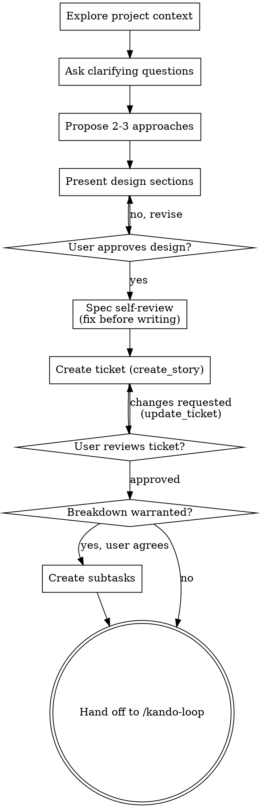

# Brainstorming Ideas Into Kando Tickets

Help turn ideas into fully formed designs through natural collaborative dialogue, then land the agreed design **on the board as a ticket** — the record the work is done from.

Start by understanding the current project context, then ask questions one at a time to refine the idea. Once you understand what you're building, present the design and get user approval.

**REQUIRED BACKGROUND:** the `kando` skill (ticket model, `KEY-N`, tags, boards). Where `/kando-refine` sharpens a ticket that already exists, this skill runs the same dialogue **before any ticket exists** and creates one at the end.

<HARD-GATE>
Do NOT invoke any implementation skill, write any code, scaffold any project, create any ticket, or take any implementation action until you have presented a design and the user has approved it. This applies to EVERY project regardless of perceived simplicity.
</HARD-GATE>

## Anti-Pattern: "This Is Too Simple To Need A Design"

Every project goes through this process. A todo list, a single-function utility, a config change — all of them. "Simple" projects are where unexamined assumptions cause the most wasted work. The design can be short (a few sentences for truly simple projects), but you MUST present it and get approval.

## Checklist

You MUST create a task for each of these items and complete them in order:

1. **Explore project context** — check files, docs, recent commits; `list_boards` to see where a ticket could land
2. **Ask clarifying questions** — one at a time, understand purpose/constraints/success criteria
3. **Propose 2-3 approaches** — with trade-offs and your recommendation
4. **Present design** — in sections scaled to their complexity, get user approval after each section
5. **Spec self-review** — check the drafted Specification for placeholders, contradictions, ambiguity, scope (see below)
6. **Create the ticket** — `create_story` with a `## 📋 Specification` body, tagged `refined`
7. **User reviews the ticket** — ask the user to read `KEY-N` before anything is built
8. **Decompose into subtasks** — only when a breakdown is genuinely warranted, and only after the user agrees
9. **Hand off** — the ticket is the terminal state; offer `/kando-loop KEY-N`

## Process Flow



**The terminal state is a ticket on the board.** Do NOT invoke any implementation skill and do NOT start building. Implementing it later is `/kando-loop`'s job, or your own — under the `kando` skill's record-then-code gate.

## The Process

**Understanding the idea:**

- Check out the current project state first (files, docs, recent commits)
- Before asking detailed questions, assess scope: if the request describes multiple independent subsystems (e.g., "build a platform with chat, file storage, billing, and analytics"), flag this immediately. Don't spend questions refining details of a project that needs to be decomposed first.
- If the idea is too large for a single ticket, help the user decompose it into sub-projects: what are the independent pieces, how do they relate, what order should they be built? Then brainstorm the first sub-project through the normal design flow. Each sub-project gets its own ticket.
- For appropriately-scoped ideas, ask questions one at a time to refine it
- Prefer multiple choice questions when possible, but open-ended is fine too
- Only one question per message - if a topic needs more exploration, break it into multiple questions
- Focus on understanding: purpose, constraints, success criteria

**Exploring approaches:**

- Propose 2-3 different approaches with trade-offs
- Present options conversationally with your recommendation and reasoning
- Lead with your recommended option and explain why
- YAGNI ruthlessly - remove unnecessary features from every approach and design

**Presenting the design:**

- Once you believe you understand what you're building, present the design
- Scale each section to its complexity: a few sentences if straightforward, up to 200-300 words if nuanced
- Ask after each section whether it looks right so far
- Cover: architecture, components, data flow, error handling, testing
- Be ready to go back and clarify if something doesn't make sense

**Design for isolation and clarity:**

- Break the system into smaller units that each have one clear purpose, communicate through well-defined interfaces, and can be understood and tested independently
- For each unit, you should be able to answer: what does it do, how do you use it, and what does it depend on?
- Can someone understand what a unit does without reading its internals? Can you change the internals without breaking consumers? If not, the boundaries need work.
- Smaller, well-bounded units are also easier for you to work with - you reason better about code you can hold in context at once, and your edits are more reliable when files are focused. When a file grows large, that's often a signal that it's doing too much.

**Working in existing codebases:**

- Explore the current structure before proposing changes. Follow existing patterns.
- Where existing code has problems that affect the work (e.g., a file that's grown too large, unclear boundaries, tangled responsibilities), include targeted improvements as part of the design - the way a good developer improves code they're working in.
- Don't propose unrelated refactoring. Stay focused on what serves the current goal.

## After the Design

### Spec self-review (BEFORE the ticket exists)

Draft the Specification, then look at it with fresh eyes **before** you write it to the board — a ticket that is right on its first write beats one you correct a minute later:

1. **Placeholder scan:** Any "TBD", "TODO", incomplete sections, or vague requirements? Fix them.
2. **Internal consistency:** Do any sections contradict each other? Does the architecture match the feature descriptions?
3. **Scope check:** Is this focused enough for one ticket, or does it need decomposition?
4. **Ambiguity check:** Could any requirement be interpreted two different ways? If so, pick one and make it explicit.
5. **Acceptance criteria:** Is each one concrete and testable — could someone else tell whether it holds?

Fix any issues inline. No need to re-review — just fix and move on.

### Create the ticket (ONLY after approval)

1. **Pick the board.** `list_boards`. One board, and it's obvious — use it. More than one, or ambiguous — ask which.
2. `create_story <BOARD KEY>` with a clear, specific title and this body:

   ```
   ## 📋 Specification
   **Problem / goal:** …
   **Approach:** <the chosen option and why>
   **Key decisions:** …
   **Acceptance criteria:** <concrete, testable bullets>
   **Out of scope:** …
   ```

   This is the same shape `/kando-refine` writes, on purpose: `/kando-loop` and the `kando-worker` agent already know how to read it.
3. `ensure_tag <board> refined`, then `update_ticket KEY-N` with `tags: ["refined"]` — the "has an agreed spec" marker. The design was agreed with the user, so the ticket is born refined.
4. If the design named a real prerequisite that is already a ticket on the same board, pass `blockedBy: ["KEY-N"]` — `next_task` will not serve the ticket until that lands.

### User review gate

Tell the user the ticket exists and ask them to read it before anything is built:

> "Created `KEY-N` — <title>. Please read it and tell me if you want anything changed before we start building."

Wait for their response. If they request changes, `get_ticket KEY-N`, revise the Specification, and `update_ticket` with the full body. Only continue once they're happy.

## Decompose into subtasks (only when a breakdown is genuinely warranted)

Runs **after** the ticket exists and the user has reviewed it. **Only suggest a breakdown when you judge one is genuinely warranted** — do NOT dangle it as a generic option on every ticket.

1. **Decide first.** A breakdown is warranted when the work splits into **multiple independently-shippable, separately-testable units**, spans **distinct concerns or sequential phases**, or is **too large for one TDD cycle**. It is NOT warranted for a single cohesive change, even a non-trivial one.
   - **If NOT warranted:** say the ticket is well-scoped as a single unit and go straight to **Hand off**.
   - **If warranted:** say so and recommend it — briefly name the units or phases you see — then ask ONE question: "Want to break this into subtasks so it can be worked step by step?" If they decline, go to **Hand off**.
2. **Breakdown sub-dialogue.** Propose an **ordered** list of subtasks — each a short title plus a one-line purpose — that together deliver the story's Specification. Iterate with the user (add / remove / reorder / merge). **Do NOT create anything until the user approves the set.**
3. **Create them (only after approval), in order.** For each agreed step, in sequence:
   - `create_subtask <STORY KEY-N>` with a clear title and a `body` that is its own Specification:
     ```
     ## 📋 Specification
     **Problem / goal:** …
     **Approach:** …
     **Acceptance criteria:** <concrete, testable bullets>
     **Out of scope:** …
     ```
   - `ensure_tag <board> refined`, then `update_ticket` the new subtask with `tags: ["refined"]`.
   - **If a step genuinely cannot start until an earlier one lands, say so with a dependency:** pass `blockedBy: ["<the earlier subtask's KEY-N>"]` to `create_subtask` (you have its `KEY-N` — you just created it). Rank is a preference; `blockedBy` is a constraint `/kando-loop` actually enforces, since `next_task` never serves a blocked ticket. Use it only for a real prerequisite, not to re-state the order you already created them in.

   Create them in discussion order so board rank matches the sequence — `/kando-loop <STORY>` then works them top-to-bottom, each to its own Acceptance criteria.

## Hand off

Tell the user what landed — `KEY-N`, its title, and the subtasks if you created any — and that it's ready to be worked:

> "`KEY-N` is on the board and refined. Want me to run `/kando-loop KEY-N`?"

**Then stop.** Building is a separate act with its own gate: if the user says yes, `/kando-loop` takes over; if you implement it yourself, you go through the `kando` skill's record-then-code gate first (plan comment + in-progress column before any repo edit).

## Never

- Never create the ticket — or any subtask — before the user has approved the design. Nothing reaches the board unapproved.
- Never write code, scaffold a project, or invoke an implementation skill from this skill. It ends at a ticket.
- Never skip the design because the idea seems simple. Short design, yes; no design, no.
- Never ask more than one clarifying question per message.
- Never write a Specification with placeholders, "TBD", or acceptance criteria nobody could test — the self-review exists to catch exactly that.
- Never offer a breakdown for a ticket that's fine as a single unit, and never create subtasks before the user approves the set.
- Never guess the board when more than one could be right — ask.
- Never spawn subagents. This is a conversation between you and the user.

---

The dialogue in this skill is adapted from the `brainstorming` skill in [Superpowers](https://github.com/obra/superpowers) (MIT, © 2025 Jesse Vincent). See `NOTICE`.
